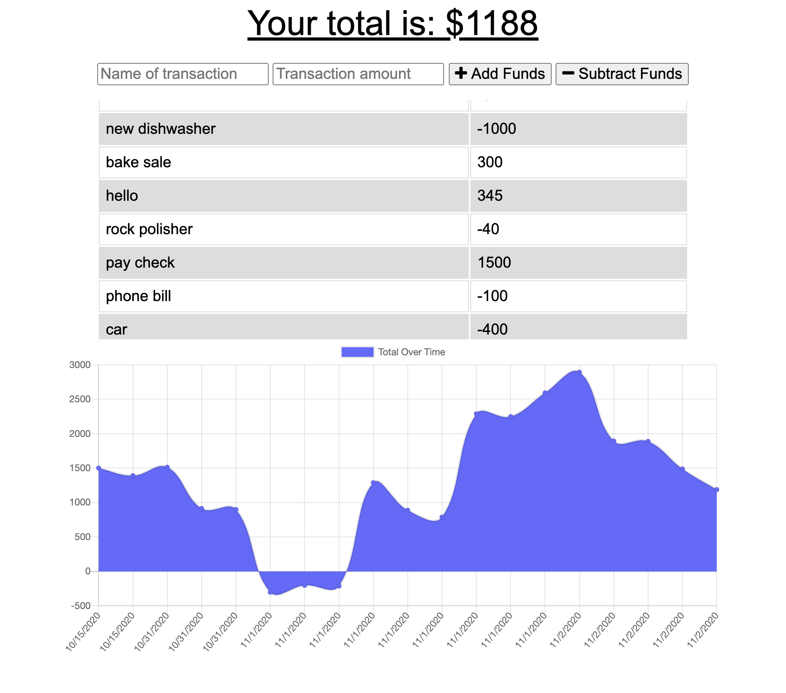

# Budget Tracker


## Description
This will track your budget expenses and income weather you are online or offline. Once you go back online it will update the database with everything that was stored while offline.

## Links
Deployed link: heroku

Repo link: https://github.com/jttilley/budget_tracker

## Author
Jason Tilley

## Tech Used
JavaScript, service worker, webmanifest, indexDB, and caching

## Table of Contents
  * [Example](#example)
    
  * [Installation](#installation)
  
  * [Usage](#usage)
  
  * [License](#license)
  
  * [Questions](#questions)
    

## Example


## Installation
To install the necessary denpendencies, run the following command:
```
npm i
```

## Usage
Run the live link or run npm start if you have a local copy.

## License
The license for this project is: *MIT* ©  2020 Jason Tilley

## Questions
If you have any questions you can email me at: jttilley007@gmail.com

Also feel free to check out my GitHub page here: https://github.com/jttilley
  

